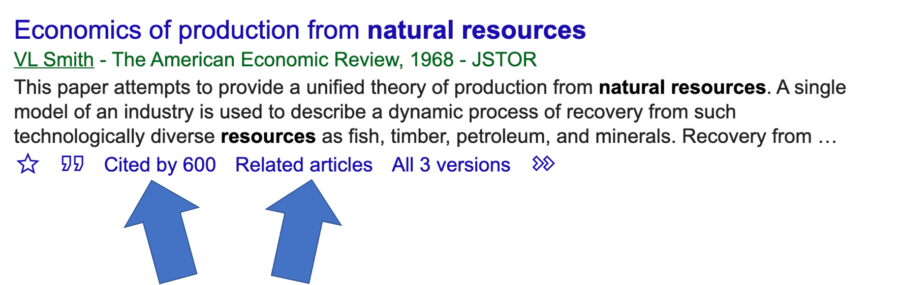

# ETP_2030:  Intro to Library Resources

## Introduction:
```
Erich Purpur
ep9k@virginia.edu

Christine Slaughter
cs7ww@virginia.edu
```

## What we do:
```
One of our main job responsibilities is to be "liaisons" to various departments at UVA. Basically this means, 
if there is some resource the department needs and the library can provide it, it is our job to make that happen. 
This could be one of many things:
    * Scholarly resources like journals, databases, data, and sometimes even books!
    * "Expert" advice on how to go about scholarly research
    * Technical Support for various softwares, statistics, etc...
    * physical space for events, studying, exhibits
    * technology like makerspace related things
```

## UVA Libraries
There are actually 11 libraries around grounds and that includes 3 that are not technically a part of the 
"UVA Libraries" organization. The law school, business school, and health science library are technically 
not affiliated with us. 

### [Visit our Homepage](https://www.library.virginia.edu/)

### UVA Libraries during covid
```
At the moment only two of our physical buildings are open, Clemons and Brown Libraries, and we have a limited 
number of staff and capacity for patrons. Library hours [can be found here](https://www.library.virginia.edu/hours).
Also, our Main library (formerly Alderman Library) is being renovated.
```

# Your Final Project

Here is what you need for writing your final project:
```
* A peer reviewed scientific journal article 
* At least one source related to: 
  * natural science
  * humanities
  * social science
* At least one government/agency source
```


## Finding peer reviewed scholarly articles

### My preferred strategy (Erich)
Google makes things easy to use. Luckily they have created [Google Scholar](https://scholar.google.com/)
There is no need to suffer the maze that is the UVA Library website!

#### How to set up Google Scholar
1. If you are not on grounds, go here: [https://scholar.google.com/](https://scholar.google.com/).
2. In the top left corner choose the three horizonal lines
3. Choose "settings"
4. On the left choose "Library Links"
5. In the search box type in "University of Virginia Libraries" and check the box

Now, you can browse for articles in basically the same way you would for a normal google search.

#### Helpful Google Scholar Tricks
If you find an article(s) that might be good for you paper, you can easily find similar results. 



##### Cited By
When scholarly articles are published, other people read them and want to incorporate that information
into their own work. The author then cites the previously written work. The <strong>cited by</strong> button 
shows you all articles that have cited the current one you are looking at. Odds are good that if an
article has cited another, they will be about similar subject matter

##### Related Articles
When articles are published, the publishing organization collects metadata about the article. Included in
this is information about the subject matter. Google Scholar does the magic of collecting all these
subject tags and creating the <strong>related articles</strong> button. As you may suspect, this button 
shows you other related articles

##### Bibliography
There is no bibliography button (yet?) but you can always look at the article in question, scroll to the end,
and look at the bibliography/works cited section. The author cited other scholarly work that came before them
in order to write their own paper. You can then look for these articles in Google Scholar.

```
Now that you have linked UVA Libraries to Google Scholar, you'll notice many results display "Find at UVA Libraries"
on the right of the results. Click this link and you'll be taken to the full text of the article, via
the UVA library website. 
```


## A More Librarian-Like Approach
Lest I be burned at the stake by fellow librarians, the UVA Library actually does work hard to make content
more easily accessible to you. 

[You can look through all UVA libguides by subject here](https://guides.lib.virginia.edu/envsci)

### Natural Science
* [Environmental Science](https://guides.lib.virginia.edu/envsci)
* [Biology](https://guides.lib.virginia.edu/biology)
* [Engineering Systems & Environment](https://guides.lib.virginia.edu/ese)

### Humanities
The Humanities are very wide ranging but here are a few that might be helpful

* [African American Studies](https://guides.lib.virginia.edu/afam_hist)
* [Anthropology](https://guides.lib.virginia.edu/anthropology)
* [Digital Humanities](https://guides.lib.virginia.edu/dh)
* [Education](https://guides.lib.virginia.edu/rse)
* [Philosophy](https://guides.lib.virginia.edu/philosophy)
* [Women, Gender, & Sexuality](https://guides.lib.virginia.edu/womenstudies)

### Social Science
Social Sciences are also wide ranging but here are several that may be useful

* [Politics](https://guides.lib.virginia.edu/politics)
* [Psychology](https://guides.lib.virginia.edu/psychology)
* [Sociology](https://guides.lib.virginia.edu/sociology)


## Government Documents
Government documents are a monster in and of themselves. You might find some results on Google Scholar
but usually they are not so easily accessible

* [Batten School of Leadership & Public Policy Research Guide](https://guides.lib.virginia.edu/batten/govdocs)
This guide shows you the way to find many law and regulation related documents

* [Government Resources in General](https://guides.lib.virginia.edu/findinggovinfo)
More generalized content

* [EPA Publications](https://www.epa.gov/nscep)

* [NOAA Publications](https://libguides.library.noaa.gov/noaapubs)

* [USDA Publications](https://www.nal.usda.gov/main/publications)

